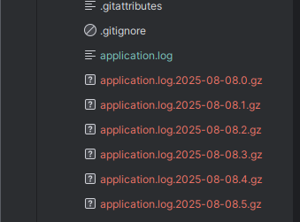

# Spring Logging

## Url

- https://docs.google.com/presentation/d/1y7uiHT28fw_S00YMOtxpzfOglgRXAMr-3_q7eL2Mqj0/edit?slide=id.p#slide=id.p

## Default Logging Setting

```
- Di spring Boot, secara default sudah memiliki setting atau pengaturan untuk looging.
- Secara default, Spring Boot melakukan logging ke Console, 
  selain itu Spring Boot juga memiliki LogFormat.
```

> Contoh: Membuat Logging
>> Membuat unit test -> class LoggingTest
> >> Result:
> > > 

## Logging Level

```
Saat menggunakan LogBack, biasanya kita bisa ubah level dari logging di file `logback.xml`. 
Namun, Springh Boot memiliki fitur dimana kita bisa menggunakan fle Spring application.properties
untuk mengubah pengaturan logging.

CARA: 
- Menggunakan prefix loging.level untuk mengubah pengaturan logging level,misal:
  1. logging.level.root=info (semua atau default).
  2. logging.level.nama,pacakage.nya=warn (spesifik ke package atau file).
```

> Contoh: Buat file `application-test.properties`
> 1. Buat foder resources di src/test/resources/application-test.properties.
> 2. Setting logging level di file `application-test.properties` kemudian running unit test LosgingTest.

## File Output - Dari console simpan ke File Log

```
- Secara default, Spring Boot melakukan logging output hanya ke console.
- Namun Spring Boot dapat mengaktifkan logging output ke Filem dengan menggungakan properties.
- logging.file.name => untuk menentukan nama file logging.
  Misal application,log atau /tmp/application.log.
- logging.file.path => menentukan nama folder outpur, dan akan menggunakan nama file sprinh.log.
  Misalnya /tmp/ maka lognya akan menjadi /tmp/spring.log.
```

> Contoh:
> 1. Menambahkan logging.file.name di file `application-test.properties`.
> 2. Running ulang unit test LoggingTest.
> 3. Kemudian muncul dan buka file application.log

```
Jadi hasilnya sama seperti di console, hanya saja sekarang ada di file. Yakni file application.log.
Kalau test ulang running, maka file application.log akan bertambah isinya.
```

## File Rolling

```
Spring Boot mempermudah untuk melakukan rolling file logging menggunakan Logback.
```

 di class LoggingTest dengan perulangan untuk mencapai ukuran file.
> 3. Kemudian test running LoggingTest. Mungkin ada 10 kilo byte, maka akan ada 10 file log.
     > Jadi setiap lebih dari 10 kilo byte, maka akan ada file baru.
     > 

## Log Grup

```
- Pada beberapa kasus, kita perlu membuat konfigurasi logging yang sama untuk beberapa pacakage.
- Spring Boot memiliki fitur bernama Log Grup, untuk membuat nama log grup dari beberapa package.
- Keuntungan: dapat menggunakan nama log grup tersebut ketika melakukan logging level
- Kita bisa menggunakan application.properties: logging.group.nama-log-grup=package1,package2,package3.

Spring juga menggunakan ini:
1. ADA grub web
2. ADA grub sql
```

> Contoh:
> Membuat logging grup di file `application-test.properties`:
> misalnya nama grubnya pzn.
> 1. buat logging.group.pzn di file `application-test.properties`.
> 2. Kemudian ubah logging levelnya menjadi warn.
> 3. Kemudian buat test testLog() di class LoggingTest.