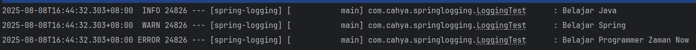

# Spring Logging

## Url
- https://docs.google.com/presentation/d/1y7uiHT28fw_S00YMOtxpzfOglgRXAMr-3_q7eL2Mqj0/edit?slide=id.p#slide=id.p

## Default Logging Setting
```
- Di spring Boot, secara default sudah memiliki setting atau pengaturan untuk looging.
- Secara default, Spring Boot melakukan logging ke Console, 
  selain itu Spring Boot juga memiliki LogFormat.
```
> Contoh: Membuat Logging
>> Membuat unit test -> class LoggingTest
> >> Result:
> >> 